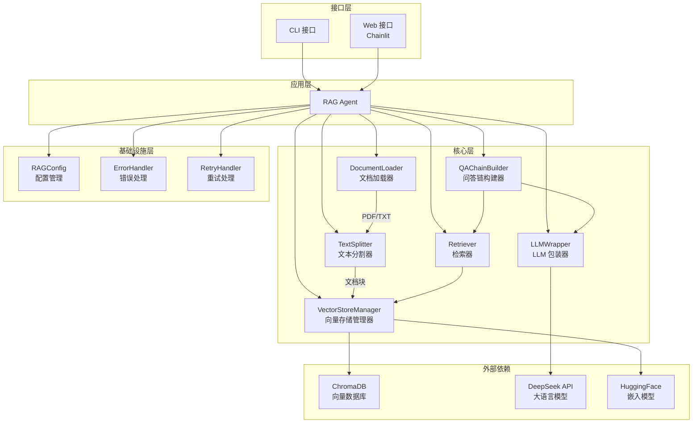
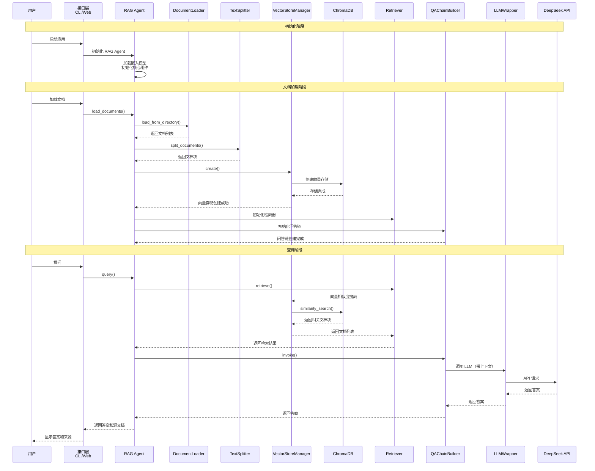

# Local RAG Agent

基于检索增强生成（Retrieval-Augmented Generation）的本地AI Agent，支持文档问答、知识检索和智能对话。

## 📋 目录

- [项目简介](#项目简介)
- [核心特性](#核心特性)
- [技术架构](#技术架构)
- [快速开始](#快速开始)
- [配置说明](#配置说明)
- [使用方式](#使用方式)
- [项目结构](#项目结构)
- [开发指南](#开发指南)
- [常见问题](#常见问题)
- [许可证](#许可证)

## 🎯 项目简介

Local RAG Agent 是一个基于 LangChain 和 ChromaDB 构建的本地 RAG（检索增强生成）demo，支持：

- 📄 **文档加载**：支持 PDF、TXT 格式
- 🔍 **智能检索**：基于向量相似度的语义检索
- 💬 **问答对话**：基于文档内容的智能问答
- 🌐 **Web 界面**：基于 Chainlit 的现代化聊天界面

## ✨ 核心特性

- 支持 PDF、TXT 文件格式，自动文档分块和向量化
- 基于 HuggingFace 嵌入模型的语义检索
- 集成 DeepSeek API，自动重试和错误处理
- 持久化向量存储（ChromaDB）
- 模块化架构设计，完善的错误处理和日志系统

## 🏗️ 技术架构

### 系统架构图



### 工作流程



## 🚀 快速开始

### 环境要求

- Python 3.12+
- Poetry（[安装指南](https://python-poetry.org/docs/#installation)）
- DeepSeek API 密钥（[获取地址](https://platform.deepseek.com/)）

### 安装步骤

#### 1. 安装 Poetry

**Windows (PowerShell):**

```powershell
(Invoke-WebRequest -Uri https://install.python-poetry.org -UseBasicParsing).Content | python -
```

**macOS/Linux:**

```bash
curl -sSL https://install.python-poetry.org | python3 -
```

安装完成后，将 Poetry 添加到 PATH（或重启终端）。

#### 2. 克隆项目

```bash
git clone <repository-url>
cd local_rag_agent
```

#### 3. 运行自动设置脚本

**Windows (PowerShell):**

```powershell
.\setup_venv.ps1
```

脚本会自动检测 Poetry 和 Python 3.12，配置 Poetry 使用项目内虚拟环境，并安装所有依赖。

#### 4. 配置 API 密钥

复制示例文件并编辑：

**Windows (PowerShell):**
```powershell
Copy-Item .env.example .env
```

**macOS/Linux:**
```bash
cp .env.example .env
```

编辑 `.env` 文件，设置你的 DeepSeek API 密钥：

```env
RAG_LLM_API_KEY=your-api-key-here
```

#### 5. 添加文档

将文档放入 `documents` 目录，支持 PDF (`.pdf`) 和文本 (`.txt`) 格式。

## ⚙️ 配置说明

项目使用 `pydantic-settings` 管理配置，所有配置项使用 `RAG_` 前缀，格式为 `RAG_{类别}_{配置项}`。

| 变量名 | 说明 | 默认值 | 必需 |
|--------|------|--------|------|
| `RAG_LLM_API_KEY` | DeepSeek API 密钥 | - | ✅ |
| `RAG_LLM_API_BASE` | LLM API 基础 URL | `https://api.deepseek.com/v1` | ❌ |
| `RAG_LLM_TEMPERATURE` | LLM 温度参数 | `0.7` | ❌ |
| `RAG_LLM_MAX_TOKENS` | LLM 最大生成 token 数 | `2000` | ❌ |
| `RAG_LLM_TIMEOUT` | LLM API 超时时间（秒） | `60` | ❌ |
| `RAG_LLM_MAX_RETRIES` | LLM API 最大重试次数 | `3` | ❌ |
| `RAG_LLM_RETRY_WAIT_BASE` | LLM API 重试基础等待时间（秒） | `2` | ❌ |
| `RAG_EMBEDDING_MODEL` | 嵌入模型名称 | `all-MiniLM-L6-v2` | ❌ |
| `RAG_LLM_MODEL` | 大语言模型名称 | `deepseek-chat` | ❌ |
| `RAG_DOCUMENT_CHUNK_SIZE` | 文档分块大小 | `1000` | ❌ |
| `RAG_DOCUMENT_CHUNK_OVERLAP` | 文档块重叠大小 | `200` | ❌ |
| `RAG_RETRIEVER_DEFAULT_K` | 默认检索文档块数量 | `10` | ❌ |
| `RAG_VECTORSTORE_PERSIST_DIRECTORY` | 向量存储目录 | `./chroma_db` | ❌ |
| `LOG_LEVEL` | 日志级别 | `INFO` | ❌ |
| `ENABLE_API_DEBUG` | 启用 API 调试日志（详细记录请求/响应） | `false` | ❌ |
| `ENABLE_SDK_DEBUG` | 启用 SDK 原始调试日志（OpenAI/DeepSeek SDK） | `false` | ❌ |
| `HF_HUB_DOWNLOAD_TIMEOUT_SECONDS` | HuggingFace 模型下载超时时间（秒） | `120` | ❌ |
| `HF_HUB_DOWNLOAD_RETRIES` | HuggingFace 模型下载重试次数 | `5` | ❌ |

配置会自动从 `.env` 文件读取，配置优先级：代码参数 > 环境变量 > 默认值。

**注意**：
- `HF_HUB_DOWNLOAD_TIMEOUT_SECONDS` 和 `HF_HUB_DOWNLOAD_RETRIES` 用于控制 HuggingFace 嵌入模型的下载行为。如果网络较慢或经常超时，可以增加超时时间（如设置为 `300` 表示 5 分钟）。
- `ENABLE_API_DEBUG` 和 `ENABLE_SDK_DEBUG` 用于启用详细的调试日志，有助于排查 API 调用和 SDK 相关问题，但会产生大量日志输出。

## 💻 使用方式

### Web 界面（推荐）

启动 Chainlit 应用：

```bash
poetry run chainlit run app/interfaces/web/chainlit_app.py
```

默认端口为 8000，浏览器会自动打开 `http://localhost:8000`。

**如果端口被占用**，可以指定其他端口：

```bash
poetry run chainlit run app/interfaces/web/chainlit_app.py --port 8001
```

或者通过环境变量设置：

```bash
# Windows PowerShell
$env:CHAINLIT_PORT=8001
poetry run chainlit run app/interfaces/web/chainlit_app.py

# Linux/macOS
export CHAINLIT_PORT=8001
poetry run chainlit run app/interfaces/web/chainlit_app.py
```

**功能**：
- 智能问答：直接输入问题，基于文档内容回答
- 文件上传：拖拽文件或使用 `/upload` 命令上传文档
- 来源追踪：显示答案参考的文档块

### 命令行模式（CLI）

```bash
poetry run python app/interfaces/cli/main.py
```

首次运行会加载嵌入模型（首次下载约 400MB），从 `documents` 目录加载文档，创建向量存储，然后进入交互式问答模式。输入 `quit` 或 `exit` 退出。

### Python API

```python
from app.application import RAGAgent
from app.infrastructure import RAGConfig

# 初始化（自动从环境变量读取配置）
config = RAGConfig()
agent = RAGAgent(config=config)

# 加载文档
documents = agent.load_documents("./documents")

# 创建向量存储
agent.create_vectorstore(documents)

# 创建问答链
agent.create_qa_chain()

# 查询
result = agent.query("你的问题")
print(result["answer"])
print(f"参考了 {len(result['source_documents'])} 个文档块")
```

## 📁 项目结构

```
local_rag_agent/
├── app/                          # 应用主目录
│   ├── __init__.py               # 包初始化（向后兼容导入）
│   ├── infrastructure/           # 基础设施层
│   │   ├── config.py             # 配置管理（RAGConfig）
│   │   ├── exceptions.py         # 自定义异常类
│   │   └── logging_config.py     # 日志配置
│   ├── core/                     # 核心层（领域逻辑）
│   │   ├── document_loader.py    # 文档加载器
│   │   ├── text_splitter.py      # 文本分割器
│   │   ├── vector_store.py       # 向量存储管理
│   │   ├── retriever.py          # 检索器
│   │   ├── llm_wrapper.py        # LLM 包装器
│   │   ├── qa_chain.py           # 问答链构建器
│   │   └── utils/                # 核心工具类
│   ├── application/              # 应用层（应用服务）
│   │   └── rag_agent.py         # RAG Agent 主类
│   ├── interfaces/               # 接口层（应用入口）
│   │   ├── cli/                  # CLI 接口
│   │   └── web/                  # Web 接口
│   └── example/                  # 示例模块
├── documents/                    # 文档目录
├── docs/                         # 项目文档
├── cursor-roles/                 # Cursor AI 角色定义
├── test/                         # 测试目录
├── .chainlit/                    # Chainlit 配置
├── .env.example                  # 环境变量示例文件
├── pyproject.toml                # Poetry 项目配置
├── setup_venv.ps1                # Windows 设置脚本
└── README.md                     # 本文件
```

## 🔧 开发指南

### 代码规范

- **Python 版本**：Python 3.12+
- **代码风格**：PEP 8
- **类型注解**：使用 `typing` 模块
- **文档字符串**：Google 风格

### 开发环境设置

```bash
# 激活 Poetry 虚拟环境
poetry shell

# 或使用 poetry run 运行命令（无需激活）
poetry run python app/interfaces/cli/main.py
```

### 代码检查和格式化

使用 Pre-commit Hooks（推荐）：

```bash
# 安装 pre-commit
poetry add --group dev pre-commit

# 安装 Git hooks
poetry run pre-commit install

# 手动运行所有检查
poetry run pre-commit run --all-files
```

或使用自动安装脚本：

```powershell
.\setup_pre_commit.ps1
```

Pre-commit 包含的检查：
- 代码格式化（yapf - Google Style）
- 代码检查（ruff）
- 导入排序（isort）
- 文件格式检查（YAML、JSON）
- 安全检查（私密信息检测）
- Markdown 格式检查

## 🔍 调试和问题排查

### 启用调试日志

在 `.env` 文件中添加：

```env
ENABLE_API_DEBUG=true
LOG_LEVEL=DEBUG
```

日志会显示：
- 检索到的每个文档块的详细内容
- 发送给 DeepSeek API 的完整请求
- DeepSeek API 的完整响应

查看日志文件：
- 应用日志：`logs/rag_agent.log`
- API 调试日志：`logs/api_debug.log`

### 常见问题排查

1. **AI 说"不知道"但文档中有相关内容**
   - 检查日志中的"检索到的文档块"，确认是否检索到了相关文档
   - 检查"发送给 API 的完整请求"，确认上下文是否正确包含相关信息
   - 尝试调整 `k` 值（检索更多文档块）

2. **检索到的文档块不相关**
   - 检查文档是否正确加载和分割
   - 尝试重新创建向量存储

3. **API 请求失败**
   - 检查日志中的错误信息
   - 确认 API 密钥是否正确
   - 检查网络连接

## ❓ 常见问题

### Q: 如何获取 DeepSeek API 密钥？

A: 访问 [DeepSeek 平台](https://platform.deepseek.com/)，注册账号并获取 API 密钥。

### Q: 支持哪些文件格式？

A: 目前支持 PDF (`.pdf`) 和文本 (`.txt`) 格式。

### Q: 向量存储在哪里？

A: 默认存储在 `./chroma_db` 目录。可以通过 `RAG_VECTORSTORE_PERSIST_DIRECTORY` 配置。

### Q: 嵌入模型首次下载很慢？

A: 嵌入模型（`all-MiniLM-L6-v2`）首次运行会从 HuggingFace 下载，约 400MB。下载完成后会缓存到本地。

### Q: 启动时提示端口被占用怎么办？

A: 如果遇到端口占用错误（如 `[Errno 10048]`），可以：

1. **使用其他端口启动**：
   ```bash
   poetry run chainlit run app/interfaces/web/chainlit_app.py --port 8001
   ```

2. **查找并关闭占用端口的进程**（Windows）：
   ```powershell
   # 查找占用 8000 端口的进程
   netstat -ano | findstr :8000
   # 结束进程（将 PID 替换为实际进程 ID）
   taskkill /PID <PID> /F
   ```

3. **通过环境变量设置端口**：
   ```powershell
   $env:CHAINLIT_PORT=8001
   poetry run chainlit run app/interfaces/web/chainlit_app.py
   ```

### Q: 模型下载超时怎么办？

A: 如果遇到模型下载超时问题，可以：
1. 增加超时时间：在 `.env` 文件中设置 `HF_HUB_DOWNLOAD_TIMEOUT_SECONDS=300`（5 分钟）
2. 增加重试次数：设置 `HF_HUB_DOWNLOAD_RETRIES=10`
3. 检查网络连接，确保可以访问 HuggingFace Hub
4. 如果使用代理，配置 `HTTP_PROXY` 和 `HTTPS_PROXY` 环境变量
5. 使用 HuggingFace 镜像站点：设置 `HF_ENDPOINT` 环境变量

### Q: 如何提高检索准确性？

A:
1. 调整 `RAG_DOCUMENT_CHUNK_SIZE` 和 `RAG_DOCUMENT_CHUNK_OVERLAP` 参数
2. 增加检索数量 `RAG_RETRIEVER_DEFAULT_K`
3. 优化文档质量和结构

### Q: 支持中文吗？

A: 完全支持。项目使用 UTF-8 编码，支持中文文档和问答。

## 📚 相关文档

- [Chainlit 使用指南](docs/chainlit-guide.md)
- [Pre-commit 使用指南](docs/pre-commit-guide.md)
- [.env 文件最佳实践](docs/env_file_best_practices.md)
- [Cursor 角色指南](docs/cursor-roles-guide.md)

## 🤝 贡献

欢迎贡献代码、报告问题或提出建议！

1. Fork 本项目
2. 创建功能分支 (`git checkout -b feature/AmazingFeature`)
3. 提交更改 (`git commit -m 'Add some AmazingFeature'`)
4. 推送到分支 (`git push origin feature/AmazingFeature`)
5. 开启 Pull Request

## 📄 许可证

本项目采用 MIT 许可证。详情请参阅 LICENSE 文件。

## 🙏 致谢

- [LangChain](https://www.langchain.com/) - LLM 应用开发框架
- [ChromaDB](https://www.trychroma.com/) - 向量数据库
- [Chainlit](https://chainlit.io/) - LLM 聊天应用框架
- [DeepSeek](https://www.deepseek.com/) - 大语言模型 API
- [HuggingFace](https://huggingface.co/) - 嵌入模型

## 📞 联系方式

如有问题或建议，请通过以下方式联系：

- 提交 [Issue](https://github.com/your-repo/issues)
- 发送邮件至 [zhangmin04144@gmail.com]

---

**Happy Coding! 🚀**
