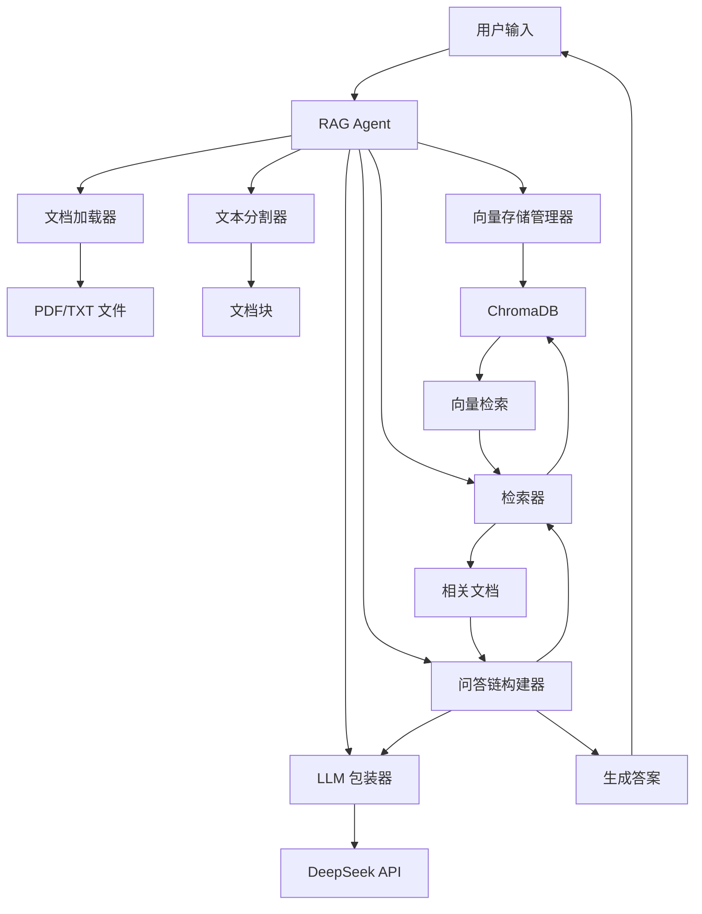
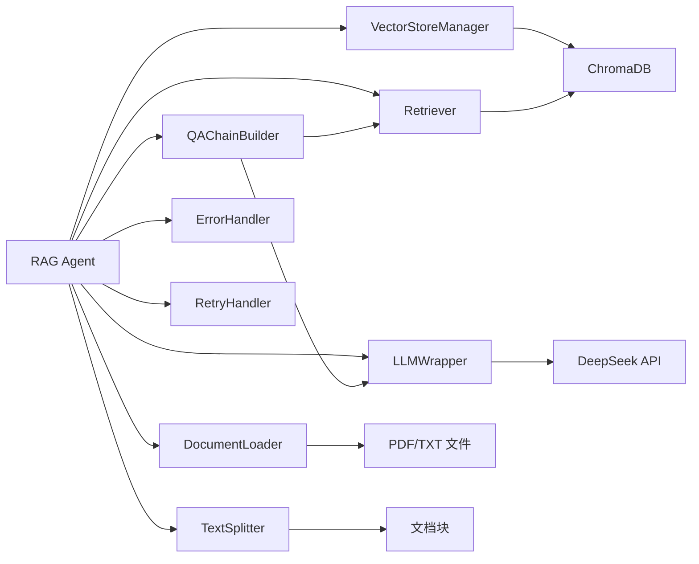
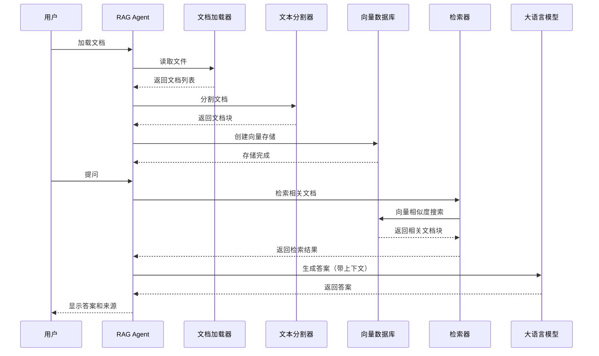

# Local RAG Agent

基于检索增强生成（Retrieval-Augmented Generation）的本地AI智能体，支持文档问答、知识检索和智能对话。

## 📋 目录

- [项目简介](#项目简介)
- [核心特性](#核心特性)
- [技术架构](#技术架构)
- [快速开始](#快速开始)
- [配置说明](#配置说明)
- [使用方式](#使用方式)
- [项目结构](#项目结构)
- [开发指南](#开发指南)
- [常见问题](#常见问题)
- [许可证](#许可证)

## 🎯 项目简介

Local RAG Agent 是一个基于 LangChain 和 ChromaDB 构建的本地 RAG（检索增强生成）系统，支持：

- 📄 **文档加载**：支持 PDF、TXT 等多种格式
- 🔍 **智能检索**：基于向量相似度的语义检索
- 💬 **问答对话**：基于文档内容的智能问答
- 🌐 **Web 界面**：基于 Chainlit 的现代化聊天界面
- 🔧 **灵活配置**：支持环境变量和配置文件

## ✨ 核心特性

### 文档处理
- 支持 PDF、TXT 文件格式
- 自动文档分块和向量化
- 持久化向量存储（ChromaDB）

### 智能检索
- 基于 HuggingFace 嵌入模型的语义检索
- 可配置的检索数量（k 值）
- 文档块重叠策略优化

### 问答系统
- 集成 DeepSeek API（兼容 OpenAI 格式）
- 自动重试和错误处理
- 支持上下文感知的问答

### 用户界面
- **CLI 模式**：命令行交互式问答
- **Web 模式**：基于 Chainlit 的 Web 界面（推荐）
- 文件上传和实时处理

### 开发特性
- 模块化架构设计
- 完善的错误处理和日志系统
- 类型注解和文档字符串
- 支持 Python 3.12+

## 🏗️ 技术架构

### 系统架构图



### 核心组件



### 工作流程



## 🚀 快速开始

### 环境要求

- Python 3.12+
- DeepSeek API 密钥（[获取地址](https://platform.deepseek.com/)）

### 安装步骤

#### 1. 克隆项目

```bash
git clone <repository-url>
cd local_rag_agent
```

#### 2. 运行自动设置脚本（推荐）

**Windows (PowerShell):**

```powershell
.\setup_venv.ps1
```


脚本会自动：
- ✅ 检测 Python 3.12
- ✅ 创建虚拟环境
- ✅ 安装所有依赖
- ✅ 准备运行环境

#### 3. 手动安装（可选）

```bash
# 创建虚拟环境
python3.12 -m venv venv

# 激活虚拟环境
# Windows
.\venv\Scripts\Activate.ps1

# 安装依赖
pip install -r requirements.txt
```

#### 4. 配置 API 密钥

创建 `.env` 文件（可复制 `app/env_example.txt`）：

```env
DEEPSEEK_API_KEY=your-api-key-here
```

可选配置：

```env
# API 配置
DEEPSEEK_API_BASE=https://api.deepseek.com/v1

# 模型配置
EMBEDDING_MODEL=all-MiniLM-L6-v2
LLM_MODEL=deepseek-chat

# 文档分块配置
CHUNK_SIZE=1000
CHUNK_OVERLAP=200

# LLM 参数
TEMPERATURE=0.7
MAX_TOKENS=2000
API_TIMEOUT=60

# 重试配置
MAX_RETRIES=3

# 日志配置
LOG_LEVEL=INFO
```

#### 5. 添加文档

将你的文档放入 `documents` 目录：

```bash
documents/
├── example.txt
├── document1.pdf
└── document2.txt
```

支持的文件格式：
- PDF (`.pdf`)
- 文本 (`.txt`)

## ⚙️ 配置说明

### 环境变量

| 变量名 | 说明 | 默认值 | 必需 |
|--------|------|--------|------|
| `DEEPSEEK_API_KEY` | DeepSeek API 密钥 | - | ✅ |
| `DEEPSEEK_API_BASE` | API 基础 URL | `https://api.deepseek.com/v1` | ❌ |
| `EMBEDDING_MODEL` | 嵌入模型名称 | `all-MiniLM-L6-v2` | ❌ |
| `LLM_MODEL` | 大语言模型名称 | `deepseek-chat` | ❌ |
| `CHUNK_SIZE` | 文档分块大小 | `1000` | ❌ |
| `CHUNK_OVERLAP` | 文档块重叠大小 | `200` | ❌ |
| `TEMPERATURE` | LLM 温度参数 | `0.7` | ❌ |
| `MAX_TOKENS` | 最大生成 token 数 | `2000` | ❌ |
| `API_TIMEOUT` | API 超时时间（秒） | `60` | ❌ |
| `MAX_RETRIES` | 最大重试次数 | `3` | ❌ |
| `LOG_LEVEL` | 日志级别 | `INFO` | ❌ |

### 配置文件

也可以通过代码直接配置：

```python
from app.config import RAGConfig
from app.rag_agent import RAGAgent

config = RAGConfig(
    persist_directory="./chroma_db",
    embedding_model="all-MiniLM-L6-v2",
    llm_model="deepseek-chat",
    chunk_size=1000,
    chunk_overlap=200,
    api_key="your-api-key"
)

agent = RAGAgent(config=config)
```

## 💻 使用方式

### 方式一：命令行模式（CLI）

运行主程序：

```bash
python app/main.py
```

或：

```bash
python -m app.main
```

首次运行会：
1. 加载嵌入模型（首次下载约 400MB）
2. 从 `documents` 目录加载文档
3. 创建向量存储
4. 进入交互式问答模式

使用示例：

```
请输入你的问题
→ 什么是 RAG？

[处理中...]

RAG（Retrieval-Augmented Generation）是一种结合了信息检索和生成式AI的技术...

参考了 3 个文档块
```

输入 `quit` 或 `exit` 退出。

### 方式二：Web 界面（推荐）

启动 Chainlit 应用：

```bash
chainlit run app/chainlit_app.py
```

或：

```bash
chainlit run app/chainlit_app.py -w
```

浏览器会自动打开 `http://localhost:8000`。

#### Web 界面功能

- 💬 **智能问答**：直接输入问题，基于文档内容回答
- 📤 **文件上传**：拖拽文件或使用 `/upload` 命令上传文档
- 📚 **文档管理**：自动处理上传的文档并创建向量存储
- 🔍 **来源追踪**：显示答案参考的文档块

#### 使用示例

1. **上传文档**：
   - 拖拽 PDF/TXT 文件到聊天窗口
   - 或输入 `/upload` 命令选择文件

2. **提问**：
   ```
   什么是 RAG？
   文档中提到了哪些技术？
   如何优化检索效果？
   ```

3. **查看来源**：
   答案下方会显示参考的文档块信息

### 方式三：Python API

```python
from app.rag_agent import RAGAgent
from app.config import RAGConfig

# 初始化
config = RAGConfig.from_env()
agent = RAGAgent(config=config)

# 加载文档
documents = agent.load_documents("./documents")

# 创建向量存储
agent.create_vectorstore(documents)

# 创建问答链
agent.create_qa_chain()

# 查询
result = agent.query("你的问题")
print(result["answer"])
print(f"参考了 {len(result['source_documents'])} 个文档块")
```

### 高级用法

#### 自定义检索数量

```python
# 创建问答链时指定 k 值
agent.create_qa_chain(k=6)  # 检索 6 个文档块

# 或查询时临时修改
result = agent.query("问题", max_retries=5)
```

#### 获取相似文档

```python
# 获取与查询最相似的文档
similar_docs = agent.get_similar_documents("查询文本", k=5)
for doc in similar_docs:
    print(doc.page_content)
```

#### 调试模式

```python
# 显示检索到的文档和调试信息
result = agent.query_with_debug("问题", show_context=True)
print(result["answer"])
print(result["debug_info"])
```

## 📁 项目结构

```
local_rag_agent/
├── app/                          # 应用主目录
│   ├── __init__.py
│   ├── main.py                   # CLI 入口
│   ├── chainlit_app.py           # Chainlit Web 应用
│   ├── rag_agent.py              # RAG Agent 主类
│   ├── config.py                 # 配置管理
│   ├── exceptions.py             # 自定义异常
│   ├── logging_config.py          # 日志配置
│   ├── ui.py                     # CLI UI 工具
│   ├── utils.py                  # 工具函数
│   └── core/                     # 核心模块
│       ├── __init__.py
│       ├── document_loader.py    # 文档加载器
│       ├── text_splitter.py      # 文本分割器
│       ├── vector_store.py       # 向量存储管理
│       ├── retriever.py         # 检索器
│       ├── llm_wrapper.py       # LLM 包装器
│       ├── qa_chain.py           # 问答链构建器
│       └── utils/                # 工具类
│           ├── error_handler.py  # 错误处理
│           └── retry_handler.py  # 重试处理
├── documents/                    # 文档目录
│   ├── example.txt
│   └── ...
├── chroma_db/                    # 向量数据库（自动创建）
├── logs/                         # 日志目录（自动创建）
├── docs/                         # 文档目录
│   ├── quickstart.md
│   ├── troubleshooting.md
│   └── ...
├── test/                         # 测试目录
│   └── test_rag_workflow.py
├── .chainlit/                    # Chainlit 配置
│   ├── config.toml
│   └── translations/
├── requirements.txt              # Python 依赖
├── setup_venv.ps1                # Windows 设置脚本
├── chainlit.md                   # Chainlit 欢迎页面
└── README.md                     # 本文件
```

## 🔧 开发指南

### 代码规范

项目遵循以下规范：

- **Python 版本**：Python 3.12+
- **代码风格**：PEP 8
- **类型注解**：使用 `typing` 模块
- **文档字符串**：Google 风格
- **错误处理**：使用自定义异常类
- **日志系统**：使用 `logging` 模块

### 开发环境设置

```bash
# 激活虚拟环境
.\venv\Scripts\Activate.ps1  # Windows

# 安装开发依赖（如果有）
pip install -r requirements-dev.txt
```

### 运行测试

```bash
# 运行测试套件
pytest test/

# 运行特定测试
pytest test/test_rag_workflow.py
```

### 代码检查

```bash
# 代码格式检查
flake8 app/

# 类型检查
mypy app/

# 代码格式化
black app/
```

### 添加新功能

1. **添加新的文档格式支持**：
   - 修改 `app/core/document_loader.py`
   - 添加对应的加载器函数

2. **修改检索策略**：
   - 修改 `app/core/retriever.py`
   - 实现自定义检索逻辑

3. **集成新的 LLM**：
   - 修改 `app/core/llm_wrapper.py`
   - 添加新的 LLM 接口

### 提交代码

1. 创建功能分支
2. 编写代码和测试
3. 运行测试和代码检查
4. 提交 Pull Request

## ❓ 常见问题

### Q: 如何获取 DeepSeek API 密钥？

A: 访问 [DeepSeek 平台](https://platform.deepseek.com/)，注册账号并获取 API 密钥。

### Q: 支持哪些文件格式？

A: 目前支持 PDF (`.pdf`) 和文本 (`.txt`) 格式。可以通过修改 `DocumentLoader` 添加更多格式支持。

### Q: 向量存储在哪里？

A: 默认存储在 `./chroma_db` 目录。可以通过 `RAGConfig.persist_directory` 配置。

### Q: 如何删除旧的向量存储？

A: 删除 `chroma_db` 目录，程序会在下次运行时重新创建。

### Q: 嵌入模型首次下载很慢？

A: 嵌入模型（`all-MiniLM-L6-v2`）首次运行会从 HuggingFace 下载，约 400MB。下载完成后会缓存到本地。

### Q: API 调用失败怎么办？

A: 
1. 检查 API 密钥是否正确
2. 检查网络连接
3. 查看日志文件 `logs/rag_agent.log`
4. 检查 API 余额和速率限制

### Q: 如何提高检索准确性？

A:
1. 调整 `chunk_size` 和 `chunk_overlap` 参数
2. 增加检索数量 `k`
3. 优化文档质量和结构
4. 尝试不同的嵌入模型

### Q: 支持中文吗？

A: 完全支持。项目使用 UTF-8 编码，支持中文文档和问答。

### Q: 如何查看详细日志？

A: 设置环境变量 `LOG_LEVEL=DEBUG`，日志会输出到 `logs/rag_agent.log`。

更多问题请参考 [故障排除指南](docs/troubleshooting.md)。

## 📚 相关文档

- [快速开始指南](docs/quickstart.md)
- [故障排除指南](docs/troubleshooting.md)
- [RAG 工作流程说明](docs/RAG_WORKFLOW_EXPLAINED.md)
- [Chainlit 使用指南](docs/chainlit-guide.md)
- [Python 3.12 安装指南](docs/INSTALL_PYTHON312.md)

## 🤝 贡献

欢迎贡献代码、报告问题或提出建议！

1. Fork 本项目
2. 创建功能分支 (`git checkout -b feature/AmazingFeature`)
3. 提交更改 (`git commit -m 'Add some AmazingFeature'`)
4. 推送到分支 (`git push origin feature/AmazingFeature`)
5. 开启 Pull Request

## 📄 许可证

本项目采用 MIT 许可证。详情请参阅 LICENSE 文件。

## 🙏 致谢

- [LangChain](https://www.langchain.com/) - LLM 应用开发框架
- [ChromaDB](https://www.trychroma.com/) - 向量数据库
- [Chainlit](https://chainlit.io/) - LLM 聊天应用框架
- [DeepSeek](https://www.deepseek.com/) - 大语言模型 API
- [HuggingFace](https://huggingface.co/) - 嵌入模型

## 📞 联系方式

如有问题或建议，请通过以下方式联系：

- 提交 [Issue](https://github.com/your-repo/issues)
- 发送邮件至 [your-email@example.com]

---

**Happy Coding! 🚀**
